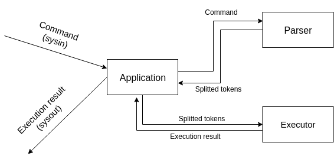

# CLI
## Обоснования выбора библиотеки argparse4j
В качестве библиотеки парсинга аргументов рассматривал:
- Apache common CLI 
- JSAP
- argparse4j

Из приведенных выше, apache common CLI предоставлял самый мощный, но громозкий интерфейс настройки парсинга, который в этой задаче не был необходим.

JSAP достаточно давно не обновлялся, что насторожило меня.
 
argparse4j имеет наиболее похожий интерфес со знакомым argparse из python. И, несмотря на то, что имеет достаточно мало "звезд" на github, команда достаточно активно обрабатыват Issue.

Поэтому я остановился на argparse4j.

### Сборка проекта:
Для сборки проекта используется [gradle](https://docs.gradle.org/current/userguide/installation.html).

Сборка проекта происходит с помощью команды:
```$bash
gradle build
```
Данная команда создаст ZIP и TAR архивы со всем необходимым для запуска в `build/distributions`.

## Основные компоненты системы:
- IToken - представление токена команды в системе
- Parser - модуль обработки строкового представления команды и перевода его в список IToken
- Context - объект, служащий для хранения текущего состояния системы (текущие переменные, флаг завершения программы)
- Executor - модуль выполнения команды по списку токенов

## Описание работы
Команда разбивается на токены с помощью компоненты Parser, каждый токен умеет выводить свое строковое представление. Так, например, токен переменная возвращает значение переменной в качестве значения.
Затем, полученный список токенов передается в модуль Executor, который исполняет команду,
на каждом шаге работы запоминая результат работы последней исполненной команды. Результат последнего шага исполнения является результатом исполнения всей команды.

#### Схема выполнения команды:


